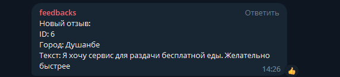
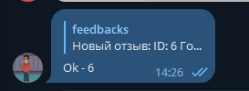
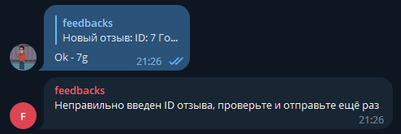

Данный проект реализует идею взаимодействие пользователей с нашей платформой для добавления
новых, выгодных сервисов в их городе. В рамках данного проекта, каждый пользователь, когда оставляет
отзыв, он регистрируется в базу данных по номеру телефона и его отзыв подвергается индивидуальному
анализу модераторами в телеграмме. Есть ограничение по размеру оставленных фоток для отзыва(до 5 МБ).
Любой отзыв отправляется чат боту в телеграмм и там до тех пор, пока модераторы не обработают отзыв,
в базу данных отзыв останется со статусом false - необработан, а когда они обрабатывают отзыв,
они могут ответить боту написав ему ok - id отзыва и всё. В данном сервисе имеется роут для всех отзывов
нажимая на которого можете посмотреть на оставленные отзывы. Включена пагинация и условия поиска, в виде 
обработанные отзывы и необработанные отзывы. Кроме этого есть роут для поиска 
отзывов по номеру телефона пользователя. Боту для удобства отправляются и фотки добавленные в отзыв, чтобы модераторы 
могли оценить каждый отзыв детально.
Вот пример работы бота:
---Бот отправляет отзыв:

Пример как нужно ответить боту:

Вдруг если вы неправильно ответите боту, то он вам сразу же ответит:
